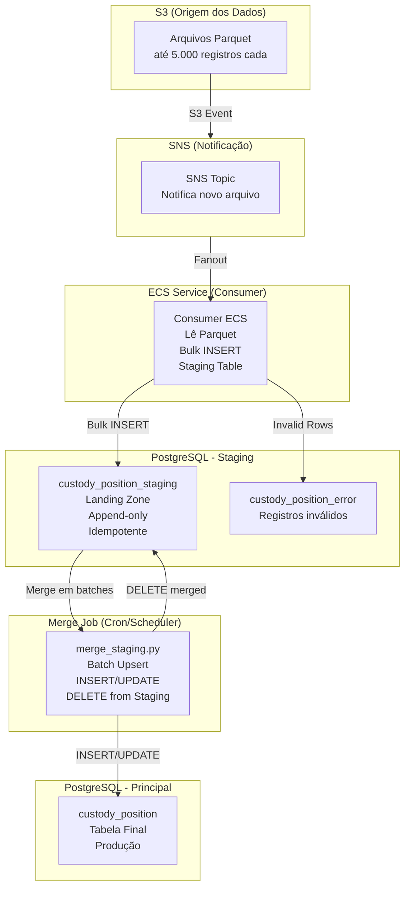

# POC — Ingestão Massiva de Dados: Parquet → Staging → Principal

Prova de conceito do fluxo de ingestão massiva de dados com staging table e merge controlado.

## Arquitetura



## Fluxo de Dados

```
1. S3: Arquivos Parquet chegam (até 5.000 registros cada)
       ↓
2. SNS: Notificação enviada ao ECS Consumer
       ↓
3. ECS: Lê parquet e faz bulk insert na staging table
       ↓
4. Staging: Dados aguardam processamento (PENDING)
       ↓
5. Cron: merge_staging.py roda a cada X segundos
       ↓
6. Merge: INSERT novos + UPDATE modificados + DELETE da staging
       ↓
7. Principal: Dados disponíveis para aplicações
```

## Tabelas

| Tabela | Função |
|--------|--------|
| `custody_position_staging` | Landing zone para dados do parquet |
| `custody_position_error` | Registros inválidos (com razão do erro) |
| `custody_position` | Tabela final de produção |

## Scripts Disponíveis

| Script | Função |
|--------|--------|
| `process_file.py` | Lê parquet do S3 e insere na staging |
| `merge_staging.py` | Merge da staging para principal (batch + throttle) |
| `simulate_load.py` | Simula carga para validação |
| `seed_database.py` | Preenche base com dados de teste |
| `generate_charts.py` | Gera gráficos das métricas |

## Uso

### 1. Processar arquivo Parquet (ECS/Consumer)

```bash
python3 scripts/process_file.py \
    --bucket poc-bucket \
    --key input/custody_position.parquet
```

### 2. Merge para tabela principal (Cron)

```bash
# Configurações via ambiente
export MERGE_BATCH_SIZE=2000
export MERGE_DELAY_SECONDS=0.5

# Executar merge
python3 scripts/merge_staging.py
```

### 3. Simular carga de produção

```bash
python3 scripts/simulate_load.py \
    --existing-records 500000 \
    --ingestion-size 1000000 \
    --update-ratio 60 \
    --batch-size 2000 \
    --delay 0.5 \
    --concurrent-ops 50 \
    --output-csv metrics.csv
```

## Merge Staging (merge_staging.py)

Este script é destinado a rodar como CRON/JobScheduler.

### Características

- **Batch size configurável**: Processa N registros por vez
- **Delay entre batches**: Pausa para não impactar operações concorrentes
- **Advisory lock**: Evita execuções concorrentes
- **Idempotente**: Não processa o mesmo registro duas vezes
- **Métricas**: Tempo, throughput, progresso

### Fluxo do Merge

```
Para cada batch:
  1. SELECT id FROM staging ORDER BY id LIMIT batch_size
  2. INSERT novos registros na principal (ON CONFLICT DO NOTHING)
  3. UPDATE registros existentes (apenas se mudou)
  4. DELETE da staging (após sucesso)
  5. COMMIT
  6. SLEEP (delay configurável)
```

### Configuração

| Variável | Default | Descrição |
|----------|---------|-----------|
| `MERGE_BATCH_SIZE` | 2000 | Registros por batch |
| `MERGE_DELAY_SECONDS` | 0.5 | Pausa entre batches |

## Simulação de Carga (simulate_load.py)

Ferramenta para simular carga de produção e validar configurações antes de deploy.

### Cenários de Teste

```bash
# Teste leve (validação rápida)
python3 scripts/simulate_load.py \
    --existing-records 10000 \
    --ingestion-size 1000 \
    --update-ratio 60

# Teste moderado (1M registros, 5 ops/s concorrência)
python3 scripts/simulate_load.py \
    --existing-records 500000 \
    --ingestion-size 1000000 \
    --update-ratio 60 \
    --batch-size 2000 \
    --delay 0.5 \
    --concurrent-ops 5

# Teste agressivo (1M registros, 50 ops/s concorrência)
python3 scripts/simulate_load.py \
    --existing-records 500000 \
    --ingestion-size 1000000 \
    --update-ratio 60 \
    --batch-size 2000 \
    --delay 0.5 \
    --concurrent-ops 50
```

### Métricas Coletadas

- **Throughput**: Registros processados por segundo
- **Latência P95**: Tempo de resposta das operações concorrentes
- **Pending Locks**: Lock contention (0 = ideal)
- **Dead Tuples**: Tuplas mortas após UPDATE (normal)
- **Cache Hit Ratio**: Eficiência do cache PostgreSQL

### Resultados dos Testes

#### Teste: 50 ops/s concorrência

| Métrica | Valor |
|---------|-------|
| Total Time | ~5 min |
| Throughput | ~3,000 regs/s |
| Errors | 0 |
| P95 Latency | ~60ms |
| Pending Locks | 0 |

#### Estimativa Aurora

| Instância | 1M registros | 4M registros |
|-----------|-------------|--------------|
| r6g.xlarge (4 vCPU, 32GB) | ~12 min | ~46 min |

## Geração de Gráficos

```bash
# Instalar dependências
pip install matplotlib pandas

# Gerar gráficos
python3 scripts/generate_charts.py metrics.csv --output ./charts

# Abrir dashboard
open charts/metrics_dashboard.png
```

## Merge Throttling (Controle de Impacto)

Para ambientes de produção com outras operações simultâneas, o merge pode ser configurado para reduzir impacto.

### Configuração

| Variável | Default | Descrição |
|----------|---------|-----------|
| `MERGE_BATCH_SIZE` | 2000 | Quantidade de registros por batch |
| `MERGE_DELAY_SECONDS` | 0.5 | Pausa entre batches (segundos) |

### Cálculo do Sweet Spot

| Batch Size | Delay | Impacto BD | Tempo (4M) |
|------------|-------|------------|------------|
| 500 | 1.0s | Mínimo | ~3.5h |
| **2000** | **0.5s** | **Baixo** | **~1h** |
| 5000 | 0.3s | Médio | ~30min |

## Padrões de Resiliencia

### Idempotência

- Unique constraint em `(source_file, row_number)` garante que mesmo parquet processado 2x não duplica
- Merge usa DELETE após sucesso, não marca status

### Retry

- Consumer ECS: retry automático via SQS visibility timeout
- Merge: se falhar, registros permanecem na staging para próxima execução

### Dead Letter Queue

- Registros inválidos vão para `custody_position_error`
- Payload JSONB preserva dados originais para investigação

## Stack

| Componente | Tecnologia |
|------------|-----------|
| Database | PostgreSQL 16 |
| Object Storage | AWS S3 (LocalStack) |
| Notifications | AWS SNS |
| Compute | ECS Fargate (simulado localmente) |
| Language | Python 3.12 |

## Setup Local

```bash
# Subir serviços
docker compose up -d

# Criar tabelas
psql -h localhost -U pocuser -d pocdb -f sql/001_init.sql

# Setup infraestrutura (S3, SNS, SQS)
python3 scripts/setup_infra.py

# Gerar e subir parquet
python3 scripts/create_sample_file.py
python3 scripts/upload_to_s3.py

# Simular notificação
python3 scripts/simulate_s3_notification.py --bucket poc-bucket --key input/custody_position.parquet

# Processar parquet (ECS)
python3 scripts/process_file.py --bucket poc-bucket --key input/custody_position.parquet

# Merge para principal (Cron)
python3 scripts/merge_staging.py
```
