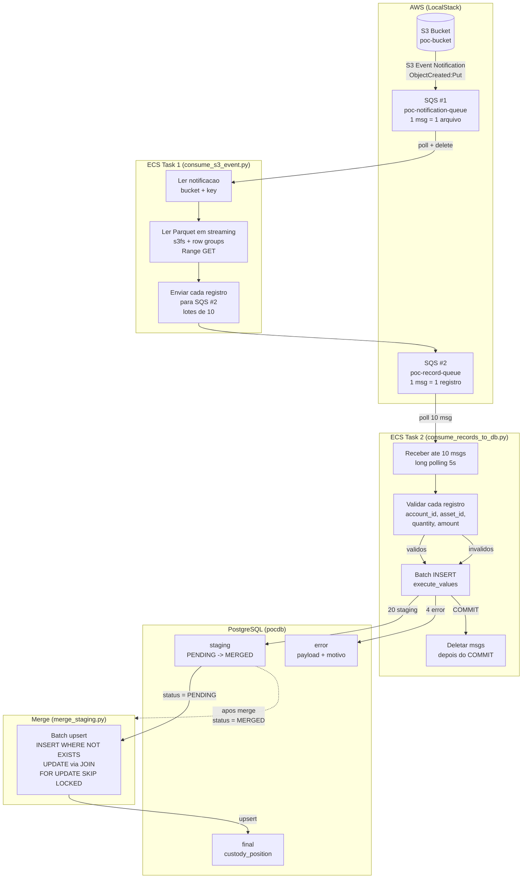

# POC v2 — Processamento Batch: S3 → SQS → SQS → PostgreSQL

Prova de conceito do fluxo completo com **duas filas SQS**, replicando o comportamento real de produção com S3 Event Notification.

## Diagrama do fluxo



## Indice

1. [O que cada etapa faz](#o-que-cada-etapa-faz)
2. [Stack](#stack)
3. [Pre-requisitos](#pre-requisitos)
4. [Setup](#setup)
5. [Execucao](#execucao)
6. [Idempotencia](#idempotencia)
7. [E se algo der errado?](#e-se-algo-der-errado)

---

## O que cada etapa faz

### SQS #1 (poc-notification-queue) — Notificacao S3

Recebe **1 mensagem por arquivo** no formato exato que o S3 envia:

```json
{
  "Records": [{
    "eventName": "ObjectCreated:Put",
    "eventSource": "aws:s3",
    "s3": {
      "bucket": { "name": "poc-bucket" },
      "object": { "key": "input/custody_position.parquet" }
    }
  }]
}
```

Em producao, quem envia isso e o proprio S3 (S3 Event Notification).
No LocalStack, usamos `simulate_s3_notification.py` para simular.

### ECS Task 1 — consume_s3_event.py

```
Entrada:                  saida:
[SQS #1]                  [SQS #2]
1 notificacao             24 registros
                          (1 por linha do Parquet)
```

1. Poll na SQS #1 (long polling 5s)
2. Extrai `bucket` + `key` do evento S3
3. Le o Parquet em streaming via s3fs (Range GET + row groups)
4. Para cada linha, monta uma mensagem JSON e envia para SQS #2 (lotes de 10)
5. Deleta a notificacao da SQS #1 apos processar o arquivo completo

### SQS #2 (poc-record-queue) — Registros individuais

Recebe **1 mensagem por linha do Parquet**:

```json
{
  "batch_id": "9a83d094-...",
  "source_file": "s3://poc-bucket/input/arquivo.parquet",
  "row_number": 0,
  "record": {
    "account_id": "ACC001",
    "asset_id": "PETR4",
    "reference_date": "2025-01-15",
    "quantity": 1000.0,
    "amount": 25000.0
  }
}
```

### ECS Task 2 — consume_records_to_db.py

```
Entrada:                  saida:
[SQS #2]                  [PostgreSQL]
24 registros              20 staging + 4 error
(3 lotes de 10+10+4)      (2 INSERTs batch)
```

1. Poll na SQS #2 (lotes de ate 10, long polling 5s)
2. Para cada mensagem: extrai o registro e valida campos
3. **1 unico INSERT** para todos os validos via `execute_values` → staging
4. **1 unico INSERT** para todos os invalidos via `execute_values` → error
5. COMMIT no PostgreSQL
6. Deleta as mensagens processadas da SQS #2
7. Se o container morre ANTES de deletar: a mensagem volta pra fila em 30s

### merge_staging.py

Inalterado da v1. Merge upsert em lotes de 10.000:
- `INSERT WHERE NOT EXISTS` para registros novos
- `UPDATE via JOIN` para registros existentes
- `FOR UPDATE SKIP LOCKED` para seguranca concorrente

---

## Stack

| Componente | Imagem / Lib | Funcao |
|------------|-------------|--------|
| Container | postgres:16 | PostgreSQL |
| Container | localstack/localstack | S3 + SQS simulados |
| Streaming S3 | s3fs + pyarrow | Leitura de Parquet via Range GET |
| SQS producer/consumer | boto3 | Envio/recebimento de mensagens |
| DB driver | psycopg2-binary + execute_values | Batch INSERT no PostgreSQL |
| Orquestracao | Docker Compose | Subida dos servicos |

---

## Pre-requisitos

- Docker e Docker Compose
- Python 3.12+

---

## Setup

```bash
# Subir servicos (PostgreSQL + LocalStack com S3 + SQS)
docker compose up -d

# Verificar se estao saudaveis
docker compose ps

# Criar ambiente Python
python -m venv .venv
source .venv/bin/activate
pip install -r requirements.txt
```

---

## Execucao

### Pipeline completo (passo a passo)

```bash
# 1. Gerar arquivo Parquet de exemplo
python scripts/create_sample_file.py
# Output: 24 linhas (20 validas + 4 invalidas)

# 2. Enviar para o S3 local
python scripts/upload_to_s3.py
# Output: Bucket criado, arquivo enviado

# 3. Simular S3 Event Notification → SQS #1
python scripts/simulate_s3_notification.py \
  --bucket poc-bucket \
  --key input/custody_position.parquet
# Output:
#   S3 Event enviado para poc-notification-queue
#   Bucket: poc-bucket
#   Key:    input/custody_position.parquet

# 4. ECS Task 1: SQS #1 → Parquet → SQS #2
python scripts/consume_s3_event.py
# Output:
#   [PROCESS] batch_id=... arquivo=s3://poc-bucket/input/...
#   Linhas: 24 | Row groups: 1
#   RG 0: enviados para SQS #2
#   24 registros enviados para SQS #2

# 5. ECS Task 2: SQS #2 → PostgreSQL
python scripts/consume_records_to_db.py
# Output:
#   Lote: 10 msgs | staging: 10 | erro: 0
#   Lote: 10 msgs | staging: 10 | erro: 0
#   Lote: 4 msgs  | staging: 0  | erro: 4
#   20 validas, 4 invalidas, 24 deletadas

# 6. Merge para tabela final
python scripts/merge_staging.py
# Output:
#   20 registros mergeados
#   Total final: 20 registros
```

### Simulando producao (3 terminais)

```bash
# Terminal 1 — Simula chegada de arquivo e processa
python scripts/simulate_s3_notification.py --bucket poc-bucket --key input/custody_position.parquet
python scripts/consume_s3_event.py

# Terminal 2 — Consome registros (pode rodar ANTES, DURANTE ou DEPOIS)
python scripts/consume_records_to_db.py

# Terminal 3 — Merge (so depois que consumer terminar)
python scripts/merge_staging.py
```

---

## Idempotencia

### Cenario 1: SQS entrega a mesma notificacao 2x

```
SQS #1 (at-least-once)
  → consume_s3_event.py processa 2x
  → SQS #2 recebe 48 mensagens (24 duplicadas)
  → consume_records_to_db.py:
      ON CONFLICT (source_file, row_number) DO NOTHING
      → 20 validas na primeira, 0 na segunda
  → Dados nao duplicam. Processamento extra, mas dados consistentes.
```

### Cenario 2: Consumer morre antes de deletar da SQS #2

```
consume_records_to_db.py:
  1. Recebe 10 mensagens
  2. INSERT no DB com sucesso  ← CRASHOU
  3. (nao deletou da SQS)
  4. Visibilidade expira em 30s → msgs voltam pra SQS #2
  5. Outro consumer processa de novo
  6. ON CONFLICT DO NOTHING → staging nao duplica
  7. Desta vez, deleta da SQS apos COMMIT
```

### Cenario 3: Merge roda 2x

```
merge_staging.py:
  - Só processa WHERE status = 'PENDING'
  - Apos merge: status = 'MERGED'
  - Segunda execucao: 0 PENDING → nada a fazer
```

---

## E se algo der errado?

| Problema | Causa | Efeito | Recuperacao |
|----------|-------|--------|-------------|
| SQS #1 vazia | Ninguem simulou notificacao | consume_s3_event encerra | Rodar simulate primeiro |
| SQS #2 vazia | consume_s3_event nao rodou | consume_records encerra | Rodar consume_s3_event |
| Consumer morre no INSERT | Timeout / OOM | Msgs voltam pra SQS #2 em 30s | Reprocessa automaticamente |
| PostgreSQL cai | Container / Aurora failover | Consumer falha, msgs voltam | DB volta, msgs reprocessam |
| LocalStack cai | `docker compose` parou | SQS + S3 indisponiveis | docker compose up -d |
| Parquet corrompido | Dado de origem invalido | consume_s3_event falha | Corrigir, reenviar notificacao |
| Schema mudou | Coluna nova no Parquet | Erro no consume_s3_event | Validar schema antes de ler |
