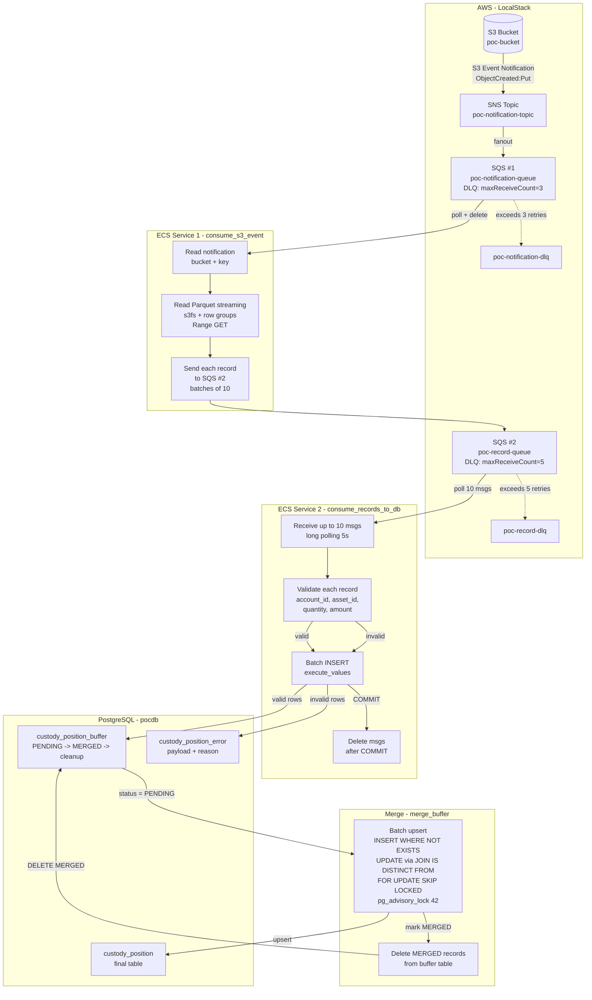

# POC v3 — Ingestao Resiliente: S3 -> SNS -> SQS -> Buffer -> Merge

Prova de conceito do fluxo completo com SNS, DLQ, buffer table e merge.

## Arquitetura



## Padroes de Resiliencia

### Dead Letter Queues (DLQs)
- SQS #1 DLQ: `poc-notification-dlq` — mensagens que falharam apos 3 tentativas
- SQS #2 DLQ: `poc-record-dlq` — registros que falharam apos 5 tentativas
- Recuperacao: reposicionar da DLQ para a fila original apos corrigir a causa

### SNS Fanout
- S3 -> SNS -> SQS #1: SNS permite multiplos subscribers (outras filas, Lambda, etc.)
- Simulation: `simulate_s3_notification.py` publica no topico SNS

### Retry com Backoff
- Consumer 1: retry exponencial para leitura S3 (1s, 2s, 4s)
- Consumer 2: retry para falhas de conexao DB
- Visibility timeout: 30s para que mensagens voltem automaticamente

### Processamento Parcial de Lotes
- Consumer 2 processa validos e invalidos no mesmo lote
- Validos -> buffer table. Invalidos -> error table.
- COMMIT so apos ambos INSERTs bem-sucedidos

### Merge com Advisory Lock
- `pg_advisory_lock(42)` previne merges concorrentes
- `FOR UPDATE SKIP LOCKED` para processamento paralelo seguro
- Lotes de 10.000 registros
- UPDATE condicional: so altera registros se `quantity` ou `amount` mudaram
  (`IS DISTINCT FROM` evita writes desnecessarios e preserva `updated_at`)

### Cleanup da Buffer Table
- Apos o merge, registros com `status = 'MERGED'` sao deletados da buffer table
- A buffer table mantém apenas registros `PENDING` (aguardando merge) e erros

## Stack

| Componente | Imagem / Lib | Funcao |
|-----------|-------------|--------|
| PostgreSQL | postgres:16 | Buffer + Final tables |
| LocalStack | localstack/localstack | S3 + SQS + SNS |
| ECS Service 1 | consumer1 (Python) | SQS->Parquet->SQS |
| ECS Service 2 | consumer2 (Python) | SQS->Buffer table |
| Merge Job | merge (Python) | Buffer->Final |
| SNS | LocalStack | Event notification fanout |

## Pre-requisitos

- Docker e Docker Compose
- Python 3.12+

## Setup

```bash
# Subir servicos
docker compose up -d

# Verificar saude
docker compose ps

# Criar e ativar ambiente Python (para scripts locais, opcional)
python -m venv .venv
source .venv/bin/activate
pip install -r requirements.txt
```

## Execucao Passo a Passo

```bash
# 1. Gerar arquivo Parquet de exemplo
python scripts/create_sample_file.py

# 2. Enviar para S3 local
python scripts/upload_to_s3.py

# 3. Setup da infraestrutura (SNS, SQS, DLQs, subscriptions)
python scripts/setup_infra.py

# 4. Simular S3 Event Notification -> SNS -> SQS #1
python scripts/simulate_s3_notification.py --bucket poc-bucket --key input/custody_position.parquet

# 5. ECS Service 1: SQS #1 -> Parquet -> SQS #2
python scripts/consume_s3_event.py

# 6. ECS Service 2: SQS #2 -> Buffer table
python scripts/consume_records_to_db.py

# 7. Merge Buffer -> Final table
python scripts/merge_buffer.py
```

### Execucao com Docker Compose

```bash
# Apos setup_infra.py + simulate_s3_notification.py:
docker compose up consumer1    # Terminal 1
docker compose up consumer2    # Terminal 2
docker compose up merge        # Terminal 3
```

## Idempotencia

### Cenario 1: SNS entrega a mesma notificacao 2x

```
SNS (at-least-once via SQS)
  -> consume_s3_event.py processa 2x
  -> SQS #2 recebe 48 mensagens (24 duplicadas)
  -> consume_records_to_db.py:
      ON CONFLICT (source_file, row_number) DO NOTHING
      -> 20 validas na primeira, 0 na segunda
  -> Dados nao duplicam. Processamento extra, mas dados consistentes.
```

### Cenario 2: Consumer morre antes de deletar da SQS #2

```
consume_records_to_db.py:
  1. Recebe 10 mensagens
  2. INSERT no DB com sucesso  <- CRASHOU
  3. (nao deletou da SQS)
  4. Visibilidade expira em 30s -> msgs voltam pra SQS #2
  5. Outro consumer processa de novo
  6. ON CONFLICT DO NOTHING -> buffer nao duplica
  7. Desta vez, deleta da SQS apos COMMIT
```

### Cenario 3: Merge roda 2x

```
merge_buffer.py:
  - So processa WHERE status = 'PENDING'
  - Apos merge: status = 'MERGED'
  - Segunda execucao: 0 PENDING -> nada a fazer
  - Advisory lock garante que apenas um merge executa por vez
```

## Matriz de Recuperacao de Erros

| Problema | Causa | Efeito | Recuperacao |
|----------|-------|--------|-------------|
| SNS nao entrega | SNS indisponivel | Notificacao nao chega ao SQS #1 | Republicar no SNS |
| SQS #1 vazia | Ninguem simulou notificacao | consume_s3_event encerra | Rodar simulate primeiro |
| DLQ notificacao recebe msg | S3 read falhou 3x | Msg vai para DLQ | Investigar causa, redrive para fila original |
| SQS #2 vazia | consume_s3_event nao rodou | consume_records encerra | Rodar consume_s3_event |
| Consumer morre no INSERT | Timeout / OOM | Msgs voltam pra SQS #2 em 30s | Reprocessa automaticamente |
| DLQ registros recebe msg | INSERT falhou 5x | Registros na DLQ | Investigar causa, redrive para fila original |
| PostgreSQL cai | Container / Aurora failover | Consumer falha, msgs voltam | DB volta, msgs reprocessam |
| LocalStack cai | `docker compose` parou | SQS + S3 + SNS indisponiveis | docker compose up -d |
| Parquet corrompido | Dado de origem invalido | consume_s3_event falha apos retries | Corrigir, reenviar notificacao |
| Schema mudou | Coluna nova no Parquet | Erro no consume_s3_event | Validar schema antes de ler |
| Merge concorrente | 2+ instancias do merge_buffer.py | Segunda espera advisory lock | Libera quando primeira termina |
| Merge trava com lock | Script morre sem unlock | Advisory lock fica preso | pg_advisory_unlock(42) ou reinicio da sessao |

## Merge Throttling (Controle de Impacto)

Para ambientes de produção com outras operações simultâneas, o merge pode ser configurado para reduzir impacto no BD.

### Configuração

| Variável | Default | Descrição |
|----------|---------|-----------|
| `MERGE_BATCH_SIZE` | 2000 | Quantidade de registros por batch |
| `MERGE_DELAY_SECONDS` | 0.5 | Pausa entre batches (segundos) |

### Cálculo do Sweet Spot

O objetivo é encontrar um ponto de equilíbrio entre tempo de processamento e impacto no BD:

| Batch Size | Batches (4kk) | Delay | Tempo Total | Impacto BD |
|------------|---------------|-------|-------------|------------|
| 500 | 8.000 | 1.0s | ~3,5h | Mínimo |
| **2000** | **2.000** | **0.5s** | **~1h** | **Baixo** |
| 3000 | 1.333 | 0.3s | ~45min | Médio |
| 5000 | 800 | 0.3s | ~30min | Médio |
| 10000 | 400 | 0s | ~15min | Alto |

### Tempos Estimados por Tamanho de Pico

| Pico | BATCH=2000, DELAY=0.5s | BATCH=3000, DELAY=0.3s |
|------|------------------------|------------------------|
| 1kk | ~17 min | ~12 min |
| 3kk | ~50 min | ~35 min |
| 4kk | ~1h08min | ~45 min |

### Recomendação

Para ambientes Aurora com 36GB RAM e operações simultâneas:
- **BATCH_SIZE=2000** com **DELAY=0.5s** é o sweet spot recomendado
- Permite que outras operações passem entre batches
- Tempo de processamento aceitável para picos de até 4kk

### Configuração no .env

```bash
# Para ambiente de produção (menor impacto)
MERGE_BATCH_SIZE=2000
MERGE_DELAY_SECONDS=0.5

# Para teste de velocidade (sem throttle)
MERGE_BATCH_SIZE=10000
MERGE_DELAY_SECONDS=0
```
