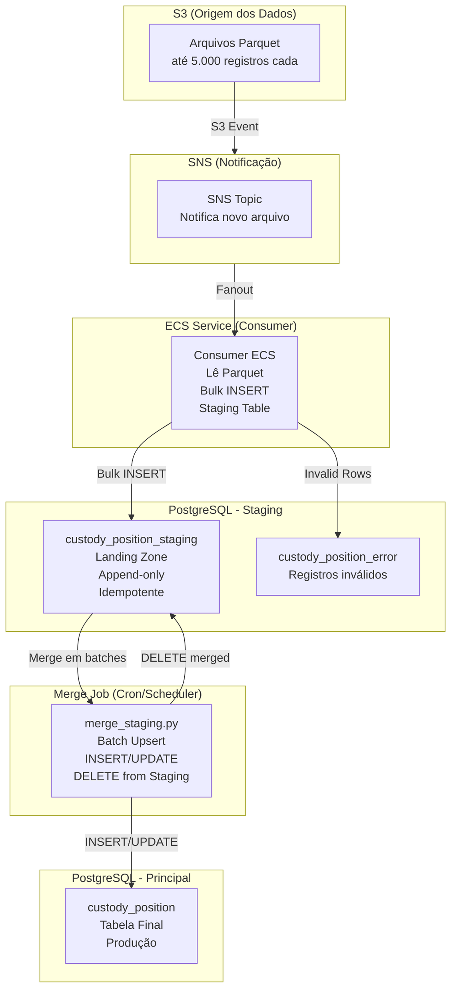

# POC — Ingestão Massiva de Dados: Parquet → Staging → Principal

Prova de conceito do fluxo de ingestão massiva de dados com staging table e merge controlado.

## Arquitetura



## Fluxo de Dados

```
1. S3: Arquivos Parquet chegam (até 5.000 registros cada)
       ↓
2. SNS: Notificação enviada ao ECS Consumer
       ↓
3. ECS: Lê parquet e faz bulk insert na staging table
       ↓
4. Staging: Dados aguardam processamento
       ↓
5. Cron: merge_staging.py roda a cada X segundos
       ↓
6. Merge: INSERT novos + UPDATE modificados + DELETE da staging
       ↓
7. Principal: Dados disponíveis para aplicações
```

## Tabelas

| Tabela | Função |
|--------|--------|
| `custody_position_staging` | Landing zone para dados do parquet |
| `custody_position_error` | Registros inválidos (com razão do erro) |
| `custody_position` | Tabela final de produção |

## Scripts Disponíveis

| Script | Função |
|--------|--------|
| `process_file.py` | Lê parquet do S3 e insere na staging |
| `merge_staging.py` | Merge da staging para principal (batch + throttle) |
| `simulate_load.py` | Simula carga para validação |
| `generate_report.py` | Gera relatório HTML das métricas |
| `seed_database.py` | Preenche base com dados de teste |
| `setup_infra.py` | Cria infraestrutura S3/SNS/SQS no LocalStack |

## Uso

### 1. Setup

```bash
# Subir serviços
docker compose up -d

# Criar tabelas
psql -h localhost -U pocuser -d pocdb -f sql/001_init.sql

# Setup infraestrutura (S3, SNS, SQS)
python3 scripts/setup_infra.py
```

### 2. Processar arquivo Parquet (ECS/Consumer)

```bash
# Gerar arquivo de exemplo
python3 scripts/create_sample_file.py
python3 scripts/upload_to_s3.py

# Simular notificação SNS
python3 scripts/simulate_s3_notification.py --bucket poc-bucket --key input/custody_position.parquet

# Processar parquet (insere na staging)
python3 scripts/process_file.py --bucket poc-bucket --key input/custody_position.parquet
```

### 3. Merge para tabela principal (Cron)

```bash
# Com configurações padrão
python3 scripts/merge_staging.py

# Ou com configurações customizadas
MERGE_BATCH_SIZE=2000 MERGE_DELAY_SECONDS=0.5 python3 scripts/merge_staging.py
```

### 4. Simular carga de produção

```bash
python3 scripts/simulate_load.py \
    --existing-records 500000 \
    --ingestion-size 1000000 \
    --update-ratio 60 \
    --batch-size 2000 \
    --delay 0.5 \
    --output-csv metrics.csv
```

### 5. Gerar relatório HTML

```bash
python3 scripts/generate_report.py metrics.csv
```

## Parâmetros

### simulate_load.py

| Parâmetro | Default | Descrição |
|-----------|---------|-----------|
| `--existing-records` | 100000 | Registros já existentes na tabela principal |
| `--ingestion-size` | 10000 | Quantidade de registros para ingestação |
| `--update-ratio` | 60 | % de registros que atualizarão dados existentes |
| `--batch-size` | 2000 | Tamanho do batch de merge |
| `--delay` | 0.5 | Delay entre batches (segundos) |
| `--output-csv` | "" | Arquivo CSV para métricas |

### merge_staging.py

| Variável | Default | Descrição |
|----------|---------|-----------|
| `MERGE_BATCH_SIZE` | 2000 | Registros por batch |
| `MERGE_DELAY_SECONDS` | 0.5 | Pausa entre batches |

## Métricas e Relatórios

O `simulate_load.py` gera um CSV com métricas que pode ser convertido em relatório HTML:

```bash
# Gerar relatório
python3 scripts/generate_report.py metrics.csv

# Abrir no navegador
open metrics_report.html
```

O relatório inclui:
- Resumo de métricas (total registros, throughput, tempo)
- Gráficos de performance
- Status de lock e dead tuples

## Merge Staging (merge_staging.py)

Este script é destinado a rodar como CRON/JobScheduler.

### Fluxo do Merge

```
Para cada batch:
  1. SELECT id FROM staging ORDER BY id LIMIT batch_size
  2. INSERT novos registros na principal (ON CONFLICT DO NOTHING)
  3. UPDATE registros existentes (apenas se mudou)
  4. DELETE da staging (após sucesso)
  5. COMMIT
  6. SLEEP (delay configurável)
```

### Características

- **Batch size configurável**: Processa N registros por vez
- **Delay entre batches**: Pausa para não impactar operações concorrentes
- **Advisory lock**: Evita execuções concorrentes
- **Idempotente**: Não processa o mesmo registro duas vezes
- **Métricas**: Tempo, throughput, progresso

## Resultados dos Testes

### Teste: 1M registros, 60% updates

| Métrica | Valor |
|---------|-------|
| Total Time | ~5 min |
| Throughput | ~3,000 regs/s |
| Pending Locks | 0 |
| Dead Tuples | Normal (limpo por autovacuum) |

### Estimativa Aurora

| Instância | 1M registros | 4M registros |
|-----------|-------------|--------------|
| r6g.xlarge (4 vCPU, 32GB) | ~12 min | ~46 min |

## Padrões de Resiliencia

### Idempotência

- Unique constraint em `(source_file, row_number)` garante que mesmo parquet processado 2x não duplica
- Merge usa DELETE após sucesso

### Retry

- Consumer ECS: retry automático via SQS visibility timeout
- Merge: se falhar, registros permanecem na staging para próxima execução

### Dead Letter Queue

- Registros inválidos vão para `custody_position_error`
- Payload JSONB preserva dados originais para investigação

## Setup Local

```bash
# Subir servicos
docker compose up -d

# Criar tabelas
psql -h localhost -U pocuser -d pocdb -f sql/001_init.sql

# Setup infraestrutura (S3, SNS, SQS)
python3 scripts/setup_infra.py

# Gerar e subir parquet
python3 scripts/create_sample_file.py
python3 scripts/upload_to_s3.py

# Simular notificação
python3 scripts/simulate_s3_notification.py --bucket poc-bucket --key input/custody_position.parquet

# Processar parquet
python3 scripts/process_file.py --bucket poc-bucket --key input/custody_position.parquet

# Merge
python3 scripts/merge_staging.py

# Simular carga
python3 scripts/simulate_load.py --existing-records 500000 --ingestion-size 1000000 --update-ratio 60
```

## Stack

| Componente | Tecnologia |
|------------|-----------|
| Database | PostgreSQL 16 |
| Object Storage | AWS S3 (LocalStack) |
| Notifications | AWS SNS |
| Compute | ECS Fargate (simulado localmente) |
| Language | Python 3.12 |
