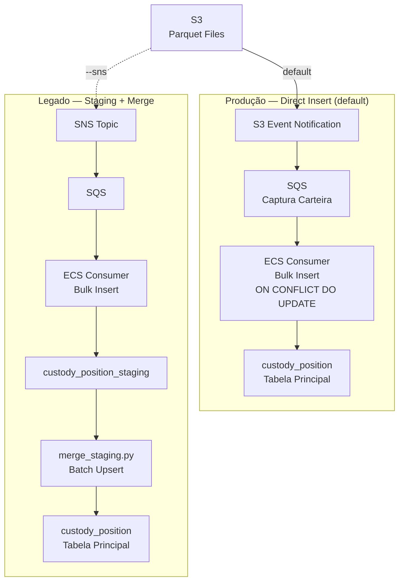

# POC — Ingestão Massiva de Dados: Parquet → PostgreSQL (Direct Insert / Staging Merge)

Prova de conceito do fluxo de ingestão massiva de dados com suporte a dois modos de operação.

## Arquitetura


```mermaid
flowchart TD
    S3_BUCKET[S3<br/>Parquet Files]
    
    subgraph DIRECT ["Produção — Direct Insert (default)"]
        S3_EVENT[S3 Event Notification] --> SQS_DIRECT[SQS<br/>Captura Carteira]
        SQS_DIRECT --> ECS_CONSUMER[ECS Consumer<br/>Bulk Insert<br/>ON CONFLICT DO UPDATE]
        ECS_CONSUMER --> PRINCIPAL_DIRECT[custody_position<br/>Tabela Principal]
    end

    subgraph LEGACY ["Legado — Staging + Merge"]
        SNS[SNS Topic] --> SQS_LEGACY[SQS]
        SQS_LEGACY --> ECS_STAGING[ECS Consumer<br/>Bulk Insert]
        ECS_STAGING --> STAGING_TABLE[custody_position_staging]
        STAGING_TABLE --> MERGE[merge_staging.py<br/>Batch Upsert]
        MERGE --> PRINCIPAL_LEGACY[custody_position<br/>Tabela Principal]
    end

    S3_BUCKET -->|default| S3_EVENT
    S3_BUCKET -.->|--sns| SNS
```

## Fluxo de Dados

### Fluxo A — Direct Insert (Produção — default)

```
1. S3: Arquivos Parquet chegam (até 5.000 registros cada)
       ↓
2. S3 Event Notification → SQS (Captura Carteira)
       ↓
3. ECS Consumer: Lê parquet e faz bulk insert direto na principal
       ↓
4. ON CONFLICT (account_id, asset_id, reference_date) DO UPDATE
       ↓
5. custody_position: Dados disponíveis para aplicações
```

### Fluxo B — Staging + Merge (Legado)

```
1. S3: Arquivos Parquet chegam (até 5.000 registros cada)
       ↓
2. SNS → SQS (notificação)
       ↓
3. ECS Consumer: Lê parquet e faz bulk insert na staging table
       ↓
4. custody_position_staging: Dados aguardam processamento
       ↓
5. merge_staging.py: INSERT novos + UPDATE modificados + DELETE da staging
       ↓
6. custody_position: Dados disponíveis para aplicações
```

## Scripts Disponíveis

> O worker ECS foi reimplementado em .NET 10 (`src/Worker/`). 
> Os scripts Python abaixo são mantidos como referência e para testes auxiliares.

| Script | Descrição |
|--------|-----------|
| `process_file.py` | (Referência Python) Lê parquet do S3 e insere na staging/direct. Substituído pelo worker .NET |
| `consume_s3_event.py` | (Referência Python) Consumer que polling SQS. Substituído pelo worker .NET |
| `setup_infra.py` | Cria S3 + S3 Bucket Notification → SQS (padrão). Use `--sns` para criar SNS também |
| `simulate_s3_notification.py` | Simula notificação S3. Use `--mode sns` (SNS) ou `--mode sqs` (SQS direto) |
| `merge_staging.py` | Merge da staging para principal (fluxo legado) |
| `simulate_load.py` | Simula carga para validação (testa só o merge) |
| `generate_report.py` | Gera relatório HTML das métricas |
| `seed_database.py` | Preenche base com dados de teste |
| `generate_parquets.py` | Gera múltiplos arquivos Parquet e sobe para S3 |

## Teste Completo End-to-End

### Fluxo de Produção (Direct Insert)

```bash
./run_complete_test.sh --target direct --files 10 --records-per-file 5000 --consumers 3
```

**Resultado**: 10 arquivos × 5.000 registros = **50.000 registros** processados por 3 consumers paralelos

### Fluxo Legado (Staging + Merge)

```bash
./run_complete_test.sh --target staging --files 10 --records-per-file 5000 --batch 2000 --delay 0.5
```

**Resultado**: 10 arquivos × 5.000 registros = **50.000 registros** via staging + merge

### Teste Aurora-like (40 arquivos — staging)

```bash
./run_complete_test.sh --target staging --files 40 --records-per-file 5000 --existing 100000 --batch 2000 --delay 0.5
```

**Resultado**: 40 arquivos × 5.000 registros = **200.000 registros** totais

### Opções do run_complete_test.sh

| Opção | Default | Descrição |
|-------|---------|-----------|
| `--files` | 10 | Número de arquivos Parquet |
| `--records-per-file` | 5000 | Registros por arquivo |
| `--existing` | 100000 | Registros existentes na base |
| `--target` | direct | `direct` (produção) ou `staging` (merge legado) |
| `--consumers` | 2 | Número de consumers paralelos (modo direct) |
| `--batch` | 2000 | Batch size do merge (modo staging) |
| `--delay` | 0.5 | Delay entre batches (modo staging) |
| `--keep-docker` | false | Não recria Docker (mais rápido) |
| `--output` | metrics_*.csv | Arquivo CSV de saída |

## Uso Individual

### 1. Setup

```bash
# Subir serviços
docker compose up -d

# Setup infraestrutura (S3, SQS, SNS opcional)
python3 scripts/setup_infra.py
```

### 2. Gerar e processar Parquets — Fluxo de Produção (Direct Insert)

```bash
# Gerar múltiplos arquivos Parquet e subir para S3
python3 scripts/generate_parquets.py --count 10 --records-per-file 5000

# O worker .NET roda automaticamente via Docker Compose
# Para múltiplos consumers paralelos:
docker compose up -d --scale consumer=3
```

### 3. Fluxo Legado (Staging + Merge)

```bash
# Gerar múltiplos arquivos Parquet e subir para S3
python3 scripts/generate_parquets.py --count 10 --records-per-file 5000

# Simular notificação SNS
python3 scripts/simulate_s3_notification.py --bucket poc-bucket --key input/custody_xxx.parquet

# Consumer (modo staging)
python3 scripts/consume_s3_event.py --target staging

# Merge para principal
python3 scripts/merge_staging.py
```

### 4. Simular carga de produção (apenas merge)

```bash
python3 scripts/simulate_load.py \
    --existing-records 500000 \
    --ingestion-size 1000000 \
    --update-ratio 60 \
    --batch-size 2000 \
    --delay 0.5 \
    --output-csv metrics.csv
```

### 5. Gerar relatório HTML

```bash
python3 scripts/generate_report.py metrics.csv
```

## Worker .NET (`src/Worker/`)

O worker ECS é uma aplicação .NET 10 que substitui os scripts Python `consume_s3_event.py` e `process_file.py`.

### Estrutura

```
src/Worker/
├── Worker.csproj                 # Projeto .NET 10
├── Program.cs                    # Entry point (Host.CreateDefaultBuilder)
├── appsettings.json              # Configuração default
├── Dockerfile                    # Multi-stage build (sdk → runtime)
├── Models/
│   ├── S3EventNotification.cs    # Modelo do evento S3
│   └── ProcessResult.cs          # Resultado do processamento
└── Services/
    ├── SqsConsumerService.cs     # BackgroundService (polling SQS)
    ├── ParquetProcessor.cs       # Leitura + validação de Parquet
    └── DatabaseService.cs        # Bulk insert PostgreSQL
```

### Bibliotecas

- **AWSSDK.S3** — Download de Parquet do S3
- **AWSSDK.SQS** — Consumo de mensagens da fila
- **Parquet.Net** — Leitura de arquivos Parquet (row groups)
- **Npgsql** — Conexão PostgreSQL com bulk upsert
- **Microsoft.Extensions.Hosting** — BackgroundService lifecycle

### Funcionalidades

- Suporta `--target direct` (default) e `--target staging` (legado)
- `--consumer-id` para logging em múltiplas instâncias
- `--max-messages` para limitar número de mensagens processadas
- Polling de profundidade da fila SQS a cada mensagem
- ON CONFLICT DO UPDATE com RETURNING para métricas precisas
- Graceful shutdown via CancellationToken

## Parâmetros

### simulate_load.py

| Parâmetro | Default | Descrição |
|-----------|---------|-----------|
| `--existing-records` | 100000 | Registros já existentes na tabela principal |
| `--ingestion-size` | 10000 | Quantidade de registros para ingestação |
| `--update-ratio` | 60 | % de registros que atualizarão dados existentes |
| `--batch-size` | 2000 | Tamanho do batch de merge |
| `--delay` | 0.5 | Delay entre batches (segundos) |
| `--output-csv` | "" | Arquivo CSV para métricas |

### merge_staging.py

| Variável | Default | Descrição |
|----------|---------|-----------|
| `MERGE_BATCH_SIZE` | 2000 | Registros por batch |
| `MERGE_DELAY_SECONDS` | 0.5 | Pausa entre batches |

### generate_parquets.py

| Parâmetro | Default | Descrição |
|-----------|---------|-----------|
| `--count` | 10 | Número de arquivos Parquet |
| `--records-per-file` | 5000 | Registros por arquivo |
| `--prefix` | input/ | Prefixo da chave S3 |

## Merge Staging (merge_staging.py) — Fluxo Legado

> Este fluxo é mantido para backward compatibility. O fluxo padrão de produção usa direct insert.

Script destinado a rodar como CRON/JobScheduler.

### Fluxo do Merge

```
Para cada batch:
  1. SELECT id FROM staging ORDER BY id LIMIT batch_size
  2. INSERT novos registros na principal (ON CONFLICT DO NOTHING)
  3. UPDATE registros existentes (apenas se mudou)
  4. DELETE da staging (após sucesso)
  5. COMMIT
  6. SLEEP (delay configurável)
```

### Características

- **Batch size configurável**: Processa N registros por vez
- **Delay entre batches**: Pausa para não impactar operações concorrentes
- **Advisory lock**: Evita execuções concorrentes
- **Idempotente**: Não processa o mesmo registro duas vezes
- **Métricas**: Tempo, throughput, progresso

## Resultados dos Testes

### Teste: 1M registros, 60% updates (staging)

| Métrica | Valor |
|---------|-------|
| Total Time | ~5 min |
| Throughput | ~3,000 regs/s |
| Pending Locks | 0 |
| Dead Tuples | Normal (limpo por autovacuum) |

### Estimativa Aurora

| Instância | 1M registros | 4M registros |
|-----------|-------------|--------------|
| r6g.xlarge (4 vCPU, 32GB) | ~12 min | ~46 min |

### Teste Completo (40 arquivos × 5000 registros — staging)

| Métrica | Valor |
|---------|-------|
| Total Records | 200.000 |
| Throughput | ~3,000 regs/s |
| Batch Size | 2000 |
| Delay | 0.5s |

## Padrões de Resiliência

### Idempotência

- **Modo direct**: `ON CONFLICT (account_id, asset_id, reference_date) DO UPDATE` garante upsert seguro
- **Modo staging**: Unique constraint em `(source_file, row_number)` garante que mesmo parquet processado 2x não duplica. Merge usa DELETE após sucesso

### Retry

- Consumer ECS: retry automático via SQS visibility timeout
- Modo staging: merge falhou → registros permanecem na staging para próxima execução

### Dead Letter Queue

- Registros inválidos vão para `custody_position_error`
- Payload JSONB preserva dados originais para investigação

### Paralelismo (Modo Direct)

- Múltiplos consumers rodam concorrentemente com `--consumer-id` distinto
- Cada consumer polling a mesma fila SQS — mensagens distribuídas automaticamente
- `ON CONFLICT DO UPDATE` garante consistência concorrente

## Stack

| Componente | Tecnologia |
|------------|------------|
| Database | PostgreSQL 16 |
| Object Storage | AWS S3 (LocalStack) |
| Notifications | S3 Event Notification → SQS (padrão) ou SNS (opcional) |
| Compute | ECS Fargate (simulado localmente via consumer container) |
| Worker Runtime | .NET 10 (C#) — src/Worker/ |
| Infra/Scripts | Python 3.12 — scripts/ |
