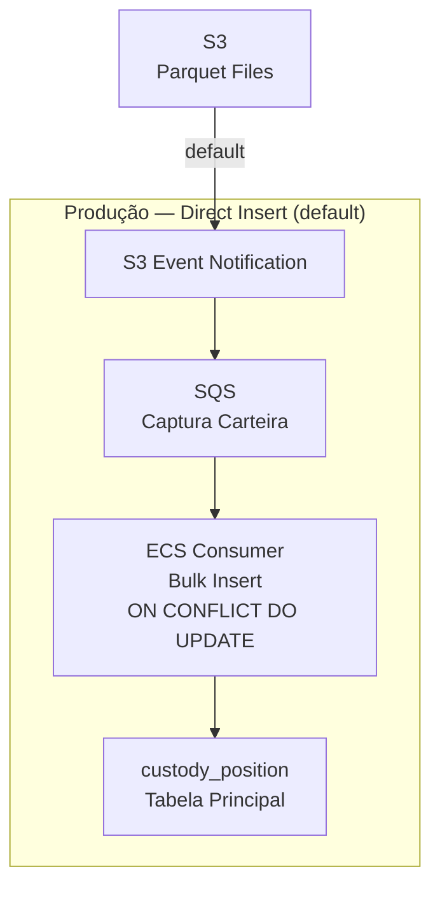

# POC — Ingestão Massiva de Dados: Parquet → PostgreSQL (Direct Insert)

Prova de conceito do fluxo de ingestão massiva de dados com suporte a direct insert via .NET 10.

## Arquitetura


```mermaid
flowchart TD
    S3_BUCKET[S3<br/>Parquet Files]
    
    subgraph DIRECT ["Produção — Direct Insert (default)"]
        S3_EVENT[S3 Event Notification] --> SQS_DIRECT[SQS<br/>Captura Carteira]
        SQS_DIRECT --> ECS_CONSUMER[ECS Consumer<br/>Bulk Insert<br/>ON CONFLICT DO UPDATE]
        ECS_CONSUMER --> PRINCIPAL_DIRECT[custody_position<br/>Tabela Principal]
    end

    S3_BUCKET -->|default| S3_EVENT
```


## Fluxo de Dados

### Fluxo A — Direct Insert (Produção — default)

```

1. S3: Arquivos Parquet chegam (até 5.000 registros cada)
       ↓
2. S3 Event Notification → SQS (Captura Carteira)
       ↓
3. ECS Consumer: Lê parquet e faz bulk insert direto na principal
       ↓
4. ON CONFLICT (account_id, asset_id, reference_date) DO UPDATE
       ↓
5. custody_position: Dados disponíveis para aplicações
```


## Scripts Disponíveis

| Script | Descrição |
|--------|-----------|
| `setup_infra.py` | Cria S3 + S3 Bucket Notification → SQS (padrão). Use `--sns` para criar SNS também |
| `simulate_s3_notification.py` | Simula notificação S3. Use `--mode sns` (SNS) ou `--mode sqs` (SQS direto) |
| `generate_parquets.py` | Gera múltiplos arquivos Parquet e sobe para S3 |
| `generate_unique_test_data.py` | Gera dados únicos (sem duplicatas entre arquivos) |
| `seed_database.py` | Preenche base com dados de teste |
| `generate_report.py` | Gera relatório HTML das métricas |
| `upload_to_s3.py` | Utilitário de upload para S3 |
| `create_sample_file.py` | Cria arquivo de amostra |

## Pré-requisitos

- **Docker** + Docker Compose
- **Python 3.12+** com `pip` (para scripts de infra/geração)
- **.NET 10 SDK** (opcional — apenas para desenvolvimento local; o build é feito via Docker)

## Teste Completo End-to-End

O script `run_complete_test.sh` orquestra o fluxo completo automaticamente:

```bash
./run_complete_test.sh --files 10 --records-per-file 5000 --consumers 3
```


**Resultado**: 10 arquivos × 5.000 registros = **50.000 registros** processados por 3 consumers paralelos.

### Opções do run_complete_test.sh

| Opção | Default | Descrição |
|-------|---------|-----------|
| `--files` | 10 | Número de arquivos Parquet |
| `--records-per-file` | 5000 | Registros por arquivo |
| `--existing` | 100000 | Registros existentes na base (opcional) |
| `--consumers` | 2 | Número de consumers paralelos |
| `--keep-docker` | false | Não recria Docker (mais rápido) |
| `--output` | metrics_*.csv | Arquivo CSV de saída |

## Uso Passo a Passo

### 1. Setup do ambiente

```bash
# Sobe PostgreSQL + LocalStack + Worker .NET
docker compose up -d

# Cria infraestrutura S3 + SQS + S3 Bucket Notification
python3 scripts/setup_infra.py
```


> O consumer .NET inicia automaticamente com o Docker. Ele pode logar
> `QueueDoesNotExistException` até o `setup_infra.py` criar a fila —
> é normal, o retry automático conecta assim que a fila existir.

### 2. Gerar dados e processar

```bash
# Gera arquivos Parquet e faz upload para o S3
python3 scripts/generate_parquets.py --count 10 --records-per-file 5000
```


A **S3 Notification** configurada no passo 1 detecta os novos arquivos
automaticamente e envia eventos para a fila SQS. O worker .NET consome
a fila, baixa cada Parquet do S3, valida as linhas e insere diretamente
na tabela `custody_position` com `ON CONFLICT DO UPDATE`.

Para múltiplos consumers paralelos (simula N tarefas ECS):

```bash
docker compose up -d --scale consumer=3
```


### 3. Verificar o processamento

```bash
# Logs do worker .NET
docker compose logs consumer --tail 50

# Contagem de registros na tabela principal
docker compose exec postgres psql -U pocuser -d pocdb \
  -c "SELECT COUNT(*) AS total FROM custody_position;"

# Registros com erro (deve ser 0)
docker compose exec postgres psql -U pocuser -d pocdb \
  -c "SELECT COUNT(*) AS errors FROM custody_position_error;"

# Profundidade da fila SQS (deve ser 0 ao final)
python3 -c "
import boto3
sqs = boto3.client('sqs', endpoint_url='http://localhost:4566',
    aws_access_key_id='test', aws_secret_access_key='test', region_name='us-east-1')
url = sqs.get_queue_url(QueueName='poc-notification-queue')['QueueUrl']
attrs = sqs.get_queue_attributes(QueueUrl=url, AttributeNames=['ApproximateNumberOfMessages'])
print(f'Queue depth: {attrs[\"Attributes\"][\"ApproximateNumberOfMessages\"]}')
"
```


### 4. Gerar relatório HTML

```bash
python3 scripts/generate_report.py metrics.csv
```

## Worker .NET (`src/Worker/`)

O worker ECS é uma aplicação .NET 10 que substitui os scripts Python `consume_s3_event.py` e `process_file.py`.

### Estrutura

```

src/Worker/
├── Worker.csproj                 # Projeto .NET 10
├── Program.cs                    # Entry point (Host.CreateDefaultBuilder)
├── appsettings.json              # Configuração default
├── Dockerfile                    # Multi-stage build (sdk → runtime)
├── Models/
│   ├── S3EventNotification.cs    # Modelo do evento S3
│   └── ProcessResult.cs          # Resultado do processamento
└── Services/
    ├── SqsConsumerService.cs     # BackgroundService (polling SQS)
    ├── ParquetProcessor.cs       # Leitura + validação de Parquet
    └── DatabaseService.cs        # Bulk insert PostgreSQL
```


### Bibliotecas

- **AWSSDK.S3** — Download de Parquet do S3
- **AWSSDK.SQS** — Consumo de mensagens da fila
- **Parquet.Net** — Leitura de arquivos Parquet (row groups)
- **Npgsql** — Conexão PostgreSQL com bulk upsert
- **Microsoft.Extensions.Hosting** — BackgroundService lifecycle

### Funcionalidades

- Suporta modo direct insert (default) com ON CONFLICT DO UPDATE
- `--consumer-id` para logging em múltiplas instâncias
- `--max-messages` para limitar número de mensagens processadas
- Polling de profundidade da fila SQS a cada mensagem
- ON CONFLICT DO UPDATE com RETURNING para métricas precisas
- Graceful shutdown via CancellationToken

## Parâmetros

### generate_parquets.py

| Parâmetro | Default | Descrição |
|-----------|---------|-----------|
| `--count` | 10 | Número de arquivos Parquet |
| `--records-per-file` | 5000 | Registros por arquivo |
| `--prefix` | input/ | Prefixo da chave S3 |

## Padrões de Resiliência

### Idempotência

`ON CONFLICT DO UPDATE`

### Retry

SQS visibility timeout

### Dead Letter Queue

`custody_position_error`

### Paralelismo

Múltiplos consumers

## Stack

| Componente | Tecnologia |
|------------|------------|
| Database | PostgreSQL 16 |
| Object Storage | AWS S3 (LocalStack) |
| Notifications | S3 Event Notification → SQS (padrão) ou SNS (opcional) |
| Compute | ECS Fargate (simulado localmente via consumer container) |
| Worker Runtime | .NET 10 (C#) — src/Worker/ |
| Infra/Scripts | Python 3.12 — scripts/ |
