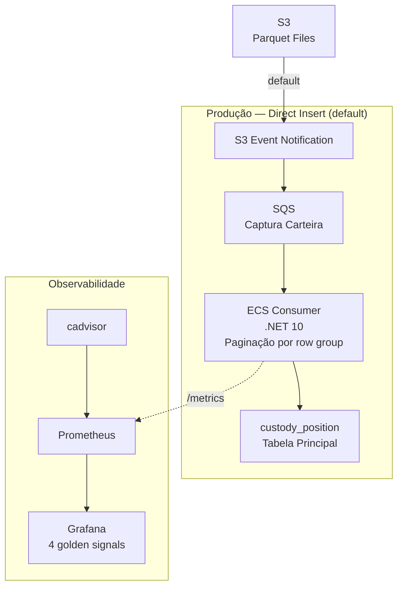
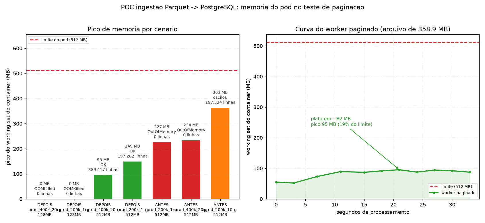

# POC — Ingestão Massiva de Dados: Parquet → PostgreSQL (Direct Insert)

Prova de conceito do fluxo de ingestão massiva de dados com **paginação por row group** e
**limite de memória no pod**, lendo arquivos Parquet do S3 e inserindo no PostgreSQL com .NET 10.

O ponto central desta POC: **ingerir um arquivo maior que a RAM do container**. O worker lê o
Parquet row group a row group, faz flush no banco e descarta — a memória fica chapada em vez de
acompanhar o tamanho do arquivo.

## Arquitetura


```mermaid
flowchart TD
    S3_BUCKET[S3<br/>Parquet Files]

    subgraph DIRECT ["Produção — Direct Insert (default)"]
        S3_EVENT[S3 Event Notification] --> SQS_DIRECT[SQS<br/>Captura Carteira]
        SQS_DIRECT --> ECS_CONSUMER[ECS Consumer<br/>.NET 10<br/>Paginação por row group]
        ECS_CONSUMER --> PRINCIPAL_DIRECT[custody_position<br/>Tabela Principal]
    end

    S3_BUCKET -->|default| S3_EVENT

    subgraph OBS ["Observabilidade"]
        PROM[Prometheus] --> GRAF[Grafana<br/>4 golden signals]
        CAD[cadvisor] --> PROM
        ECS_CONSUMER -.->|/metrics| PROM
    end
```

## Fluxo de Dados

### Fluxo A — Direct Insert (Produção — default)

```

1. S3: Arquivos Parquet chegam
       ↓
2. S3 Event Notification → SQS (Captura Carteira)
       ↓
3. ECS Consumer:
       a. baixa o objeto do S3 por STREAMING para arquivo temporário em disco
       b. lê o Parquet ROW GROUP por ROW GROUP (o row group é a página)
       c. fatia cada row group em lotes de `FlushBatchSize` (default 2000)
       d. upsert incremental e descarte do lote
       ↓
4. INSERT ... ON CONFLICT (account_id, asset_id, reference_date) DO UPDATE
       ↓
5. custody_position: Dados disponíveis para aplicações
```

---

## Paginação e Memória

### O row group é a unidade de paginação

Parquet **não tem índice de linha**. A menor unidade endereçável do formato é o **row group**, e
quem define o tamanho dele é o **writer** do arquivo, não o leitor:

- Magic `PAR1` no início e no fim (obrigatório).
- **Footer** (últimos KB) com schema, total de linhas e, por row group: nº de linhas, tamanho em
  bytes e, por coluna, o offset + encoding + estatísticas (`min`/`max`/`null_count`).
- Cada row group é um bloco contíguo de bytes → endereçável por `Range GET` no S3.

### O que define o pico de memória

Não é o tamanho do arquivo:

```
pico ≈ 60 MB (baseline do runtime)
      + bytes DESCOMPRIMIDOS DAS COLUNAS LIDAS no maior row group × 2 a 4
```

Dois fatores, então:

1. **Row group** — se o arquivo tem um row group de 300 MB, o leitor precisa materializar os
   row groups em pedaços: para `ParquetReader.OpenRowGroupReader` o piso é o row group.
2. **Projeção de colunas** — o worker lê só as 5 colunas que vão para `custody_position`. Num
   schema de 40 colunas isso corta o custo em ~8×. `ReadColumnAsync` busca apenas o column chunk
   pedido, então a projeção é real (não é só cosmética).

**O leitor não conserta o arquivo.** Se o writer gravar um row group gigante com todas as colunas
sendo necessárias, nenhum código de leitura resolve — aí o caminho é `ParquetSharp` (leitura por
página) ou reescrever a origem com `row_group_size` menor. Medido nesta POC: um arquivo com **um**
row group de 312.7 MB descomprimidos passou porque só 5 de 40 colunas eram lidas (pico de 149 MB);
se todas as 40 fossem necessárias, não passaria.

### Ordem de alavancagem dos ajustes

1. **Projeção de colunas** — leia só o que vai para o banco. Ganho mais barato num schema largo.
2. **`row_group_size` na escrita** — quem gera o parquet controla o piso de memória.
3. **Streaming para disco em vez de `MemoryStream`** — o arquivo nunca inteiro na RAM.
4. **Flush por row group + `Clear()`** — libera o lote antes de carregar o próximo row group.
5. **`FlushBatchSize` baixo** (2.000) — o array de parâmetros do `NpgsqlCommand` é pico de memória.

### Como medir um arquivo antes de subir

```python
import pyarrow.parquet as pq
pf = pq.ParquetFile("arquivo.parquet")
print("cols:", pf.metadata.num_columns, "| rows:", pf.metadata.num_rows,
      "| row groups:", pf.metadata.num_row_groups)
for i in range(pf.metadata.num_row_groups):
    rg = pf.metadata.row_group(i)
    print(i, rg.num_rows, round(rg.total_byte_size / 1024 / 1024, 1), "MB descomprimido")
```

Multiplique o maior row group por **2 a 4×** (UTF-16 + overhead de objeto no .NET) e você tem o
mínimo de RAM do pod para aquele arquivo.

### Como ler a curva de memória (evita falso negativo)

Com flush por row group, **não espere dente de serra** no gráfico. O GC do .NET não devolve memória
para o SO na hora — ele reaproveita. O esperado é o working set **subir e estabilizar num platô**
abaixo do limite. É o platô que prova o sucesso.

---

## Teste de Memória (arquivo maior que a RAM do pod)

### Passo a passo

```bash
# 1. Sobe a stack (PostgreSQL + emulador AWS + worker + observabilidade)
docker compose up -d

# 2. Cria bucket, fila, DLQ e notificação
python3 scripts/setup_infra.py

# 3. Gera um parquet de teste e sobe para o S3
#    ~1GB, schema largo (40 colunas), row groups de 20k linhas
python3 scripts/generate_large_parquet.py --target-size-mb 1024 \
    --row-group-rows 20000 --columns 40 --output data/large_1gb.parquet --upload

# 4. Roda o teste: dispara a notificação e acompanha memória + contagens
./scripts/run_memory_test.sh --key input/large_1gb.parquet --limit-mb 512

# 5. Gera o gráfico a partir das amostras
pip install matplotlib
python3 scripts/plot_memory_test.py \
    --results docs/memory-test-results.json \
    --curve reports/memory_test_DEPOIS.csv \
    --out docs/assets/memoria-antes-depois.png
```

### Cenários do gerador

| Uso | Comando |
|-----|---------|
| Cenario de produção (200k linhas, schema largo, 10 row groups) | `--rows 200000 --row-group-rows 20000 --columns 40` |
| Row group único gigante (pior caso do leitor) | `--rows 200000 --row-group-rows 200000 --columns 40` |
| Demo do loop de paginação (log mostra `rg 1/10`) | `--rows 10000 --row-group-rows 1000` |
| Alvo por tamanho, com aviso de risco de OOM | `--target-size-mb 1024 --limit-mb 512` |

> Não use row groups minúsculos (100 linhas) num arquivo grande: cada row group carrega metadata
> própria (header de column chunk **por coluna**, dicionário, página) e o footer vira um índice
> gigante. A compressão por dicionário também opera dentro do row group — ele fica maior que o dado.

### Resultados medidos

Medições de 2026-09-13, .NET 10.0.12, limite de 512 MB, S3 local. Detalhe por cenário em
[`docs/memory-test-results.json`](docs/memory-test-results.json).



| Código | Arquivo | Disco | Row groups | Pico | Resultado |
|--------|---------|-------|-----------|------|-----------|
| antes | prod_200k_1rg | 167.9 MB | 1 × 312.7 MB | 226 MB | `OutOfMemoryException`, 0 linhas |
| antes | prod_400k_20rg | 358.9 MB | 20 × 32.5 MB | 233 MB | `OutOfMemoryException`, 0 linhas |
| antes | prod_200k_10rg | 179.5 MB | 10 × 32.5 MB | 363 MB | oscilou: 1 rodada passou (197.324 linhas), a repetição estourou |
| **depois** | **prod_400k_20rg** | **358.9 MB** | **20 × 32.5 MB** | **95 MB** | **OK — 389.417 linhas, 0 erros** |
| depois | prod_200k_1rg | 167.9 MB | 1 × 312.7 MB | 149 MB | OK — 197.262 linhas |
| depois | prod_400k_20rg | 358.9 MB | 20 × 32.5 MB | — | `OOMKilled` (exit 137) com limite de **128 MB** |

Leituras:

- O arquivo **2,1× maior** passou com **4× menos memória** que o código anterior.
- O código anterior opera no fio da navalha: o mesmo arquivo, no mesmo limite, passa numa rodada e
  estoura na seguinte. Resultado não determinístico é pior que falha consistente.
- `128 MB` **não** é um limite viável: o runtime (.NET + AWS SDK + Npgsql + GC) já consome ~60 MB e
  o kernel mata o container antes de qualquer coisa. O piso real é o runtime **mais** o row group.
- O heap gerenciado do worker paginado ficou entre **12 e 32 MB** durante todo o processamento.

### Idempotência

Reprocessar o mesmo arquivo com a tabela já populada: `+0 ins ~5395 upd`, contagem estável em
197.262 linhas. O **estado final é idempotente**.

Os `UPDATE`s são churn de **chaves duplicadas dentro do arquivo cruzando lotes** (a primeira
ocorrência vence dentro de cada lote). Para um teste com zero escrita, gere dado sem duplicata de
chave — o repo já tem `scripts/generate_unique_test_data.py`.

---

## Observabilidade — 4 Golden Signals

```bash
docker compose up -d          # ja sobe prometheus, grafana e cadvisor
# Grafana:  http://localhost:3000   (admin/admin — dashboard provisionado)
# Prometheus: http://localhost:9090
```

O dashboard `POC Ingestão Parquet — Paginação e Memória` é **provisionado como código**
(`observability/grafana/dashboards/ingestion-memory.json`) — sobe junto com o compose, sem clique.

| Golden signal | Painéis | Métrica |
|---------------|---------|---------|
| **Traffic** | linhas/s, MB/s do S3, row groups e arquivos | `poc_parquet_rows_processed_total`, `poc_parquet_bytes_downloaded_total`, `poc_parquet_row_groups_total`, `poc_ingest_files_total` |
| **Latency** | p50/p95 por row group, p50/p95 do upsert | `poc_parquet_rowgroup_read_seconds`, `poc_db_upsert_seconds` |
| **Errors** | inválidos/min, OOM e restarts do pod | `poc_ingest_invalid_records_total`, `container_oom_events_total`, `container_start_time_seconds` |
| **Saturation** | memória do pod (% do limite), working set vs heap do GC, CPU e throttling | `container_memory_working_set_bytes` ÷ `container_spec_memory_limit_bytes`, `dotnet_total_memory_bytes`, `container_cpu_cfs_throttled_periods_total` |

O golden signal de **saturation é do pod**, não do processo — por isso o `cadvisor` é obrigatório:
sem `container_memory_working_set_bytes` não há como comparar o consumo com o `mem_limit`.

> Em ambiente com daemon Docker containerizado (dind), o `cadvisor` não enumera os cgroups
> aninhados e as métricas de container não aparecem; use `docker stats`/`run_memory_test.sh` como
> fonte da curva de memória. As métricas da aplicação (`poc_*`) funcionam normalmente.

---

## Scripts Disponíveis

| Script | Descrição |
|--------|-----------|
| `setup_infra.py` | Cria S3 + SQS + DLQ + S3 Bucket Notification. Use `--sns` para criar SNS também |
| `generate_large_parquet.py` | **Gera Parquet grande com `row_group_size` controlado** (`--rows`, `--target-size-mb`, `--row-group-rows`, `--columns`, `--upload`) |
| `run_memory_test.sh` | **Roda o teste de memória**: dispara um parquet do S3 e acompanha memória + contagens |
| `plot_memory_test.py` | **Gera o gráfico** a partir do JSON de resultados e das amostras de memória |
| `simulate_s3_notification.py` | Simula notificação S3. Use `--mode sqs` (direto) ou `--mode sns` |
| `generate_parquets.py` | Gera múltiplos arquivos Parquet e sobe para S3 |
| `generate_unique_test_data.py` | Gera dados únicos (sem duplicatas entre arquivos) |
| `seed_database.py` | Preenche base com dados de teste |
| `generate_report.py` | Gera relatório HTML das métricas |
| `upload_to_s3.py` | Utilitário de upload para S3 |
| `create_sample_file.py` | Cria arquivo de amostra |

## Pré-requisitos

- **Docker** + Docker Compose
- **Python 3.12+** com `pip` (para scripts de infra/geração)
- **.NET 10 SDK** (opcional — apenas para desenvolvimento local; o build é feito via Docker)

> **Emulador AWS:** usamos **`ministackorg/ministack`** (free, MIT, drop-in na porta 4566).
> O `localstack/localstack:latest` passou a exigir `LOCALSTACK_AUTH_TOKEN` e sai com
> **código 55 / "License activation failed"** — a stack não subia mais.
>
> **Notificação S3 → SQS:** o ministack implementa `PutBucketNotificationConfiguration` como
> control-plane e **não entrega** os eventos na fila. Para o teste local, dispare manualmente com
> `python3 scripts/simulate_s3_notification.py --bucket poc-bucket --key <key> --mode sqs`
> (é o que o `run_memory_test.sh` faz).

## Uso Passo a Passo

### 1. Setup do ambiente

```bash
docker compose up -d
python3 scripts/setup_infra.py
```

> O consumer .NET inicia automaticamente. Ele pode logar `QueueDoesNotExistException` até o
> `setup_infra.py` criar a fila — é normal, o retry automático conecta assim que a fila existir.

### 2. Gerar dados e processar

```bash
python3 scripts/generate_parquets.py --count 10 --records-per-file 5000
```

Para múltiplos consumers paralelos (simula N tarefas ECS):

```bash
docker compose up -d --scale consumer=3
```

> **Cuidado com o limite de memória ao escalar:** o `mem_limit` do compose é por container, mas a
> soma dos consumers é o que importa no nó. Com 4 consumers em 512 MB e um arquivo cujo maior row
> group custa 100 MB, são ~400 MB só de row groups simultâneos.

### 3. Verificar o processamento

```bash
docker compose logs consumer --tail 50

docker compose exec postgres psql -U pocuser -d pocdb \
  -c "SELECT COUNT(*) AS total FROM custody_position;"

docker compose exec postgres psql -U pocuser -d pocdb \
  -c "SELECT COUNT(*) AS errors FROM custody_position_error;"
```

O log do worker mostra o progresso por row group com a memória do processo:

```
[rg 1/20] rows=20,000 | +19965 ins ~32 upd -0 err | managed=15MB workingSet=139MB
[rg 20/20] rows=20,000 | +389417 ins ~10521 upd -0 err | managed=32MB workingSet=173MB
Result: +389417 ins ~10521 upd -0 err / 400000 total [s3://poc-bucket/input/prod_400k_20rg.parquet]
```

## Worker .NET (`src/Worker/`)

### Estrutura

```
src/Worker/
├── Worker.csproj                 # Projeto .NET 10 — versões pinadas
├── Program.cs                    # Entry point (Host.CreateDefaultBuilder)
├── appsettings.json              # Configuração default
├── Dockerfile                    # Multi-stage build (sdk:10.0.401 → runtime:10.0.12)
├── Models/
│   ├── S3EventNotification.cs    # Modelo do evento S3
│   └── ProcessResult.cs          # Resultado do processamento
└── Services/
    ├── SqsConsumerService.cs     # BackgroundService (polling SQS)
    ├── ParquetProcessor.cs       # Streaming + leitura por row group + flush incremental
    ├── DatabaseService.cs        # Upsert em statement único (RETURNING xmax)
    ├── IngestMetrics.cs          # Métricas em /metrics
    └── MetricsServerService.cs   # Servidor Prometheus
```

### Bibliotecas

- **AWSSDK.S3 / AWSSDK.SQS** — S3 e SQS (versões pinadas)
- **Parquet.Net** — leitura de Parquet (row groups)
- **Npgsql** — PostgreSQL, upsert com `RETURNING (xmax = 0)`
- **Microsoft.Extensions.Hosting** — lifecycle do BackgroundService
- **prometheus-net** — exposição de `/metrics`

### Parâmetros

`appsettings.json` / variáveis de ambiente (prefixo `Consumer__`, `PostgreSQL__`, `Metrics__`):

| Parâmetro | Default | Efeito |
|-----------|---------|--------|
| `Consumer:FlushBatchSize` | 2000 | Linhas acumuladas antes de cada flush no banco. **É o principal controle de pico de memória por lote** |
| `Consumer:TempPath` | `/tmp/poc-ingest` | Onde o parquet é materializado em disco (nunca inteiro na RAM) |
| `Consumer:MaxWorkers` | 4 | Consumers concorrentes dentro do container |
| `Consumer:MaxMessages` | 0 | Limita mensagens processadas e encerra (útil em teste) |
| `PostgreSQL:BatchSize` | 2000 | Trava de segurança do fatiamento no upsert |
| `Metrics:Port` | 9464 | Porta do `/metrics` |
| `DOTNET_GCHeapHardLimitPercent` | `0x4B` (75%) | Trava do heap gerenciado relativa ao limite do cgroup |

Pelo `run_complete_test.sh`:

| Opção | Default | Descrição |
|-------|---------|-----------|
| `--files` | 10 | Número de arquivos Parquet |
| `--records-per-file` | 5000 | Registros por arquivo |
| `--existing` | 100000 | Registros existentes na base (opcional) |
| `--consumers` | 2 | Número de consumers paralelos |
| `--keep-docker` | false | Não recria Docker (mais rápido) |

Pelo `generate_large_parquet.py`:

| Opção | Default | Descrição |
|-------|---------|-----------|
| `--rows` | — | Número exato de linhas |
| `--target-size-mb` | 1024 | Tamanho alvo do arquivo (usado se `--rows` não for dado) |
| `--row-group-rows` | 20000 | **Linhas por row group** — o knob do teste |
| `--columns` | 5 | Total de colunas (5 = schema da POC; >5 = schema largo) |
| `--limit-mb` | — | Limite do pod, só para o veredito de risco de OOM |
| `--upload` | false | Sobe para o S3 da POC |

## Padrões de Resiliência

### Idempotência

`ON CONFLICT DO UPDATE` em statement único, com deduplicação **dentro do lote**. O Postgres rejeita
a mesma chave duas vezes no mesmo statement (`21000 cannot affect row a second time`) — duplicata
dentro do lote é normal neste volume, então a primeira ocorrência vence, de forma determinística.

Contagem exata de insert vs update via `RETURNING (xmax = 0)`: linha inserida tem `xmax = 0`.

### Retry

SQS visibility timeout.

### Dead Letter Queue

`custody_position_error` recebe o **payload inválido**. Atenção: o fluxo `direct` **não** tem DLQ
configurada para mensagens que falham por erro de processamento — o worker loga, não deleta a
mensagem e ela volta após o visibility timeout, reprocessando em loop. Ao processar um arquivo que
estoura a memória, isso significa **re-download do arquivo a cada tentativa**.

### Paralelismo

Múltiplos consumers (`--scale consumer=N`).

## Stack

| Componente | Tecnologia |
|------------|------------|
| Database | PostgreSQL 16 |
| Object Storage | S3 (ministack) |
| Notifications | S3 Event Notification → SQS |
| Compute | ECS Fargate (simulado localmente via container) |
| Worker Runtime | .NET 10 (C#) / runtime 10.0.12 — `src/Worker/` |
| Métricas | prometheus-net → Prometheus → Grafana + cadvisor |
| Infra/Scripts | Python 3.12 — `scripts/` |

## Limitações conhecidas

- **Limite mínimo viável de memória**: ~150-200 MB para este runtime. Com 128 MB o container é
  morto pelo kernel antes de processar qualquer coisa (`OOMKilled`, exit 137).
- **`MaxWorkers > 1` multiplica o pico**: cada worker ativo segura o próprio row group. Dimensione
  o limite como `(baseline do runtime) + (workers × row group × multiplicador)`.
- **S3 local não limita banda**: com `ministack` o download é rápido e a falha do código antigo
  ocorre em ~2 s. Em S3 real o mesmo pico aparece, só mais devagar.
- **cadvisor em dind**: não enumera cgroups aninhados (veja Observabilidade).
- **Majors dos pacotes**: ficamos no mesmo major (AWSSDK 3.x, Parquet.Net 5.x, Npgsql 9.x). Existem
  majors mais novos (4.x, 6.x, 10.x) — trocar major tem blast radius próprio e não faz parte deste
  ajuste.
