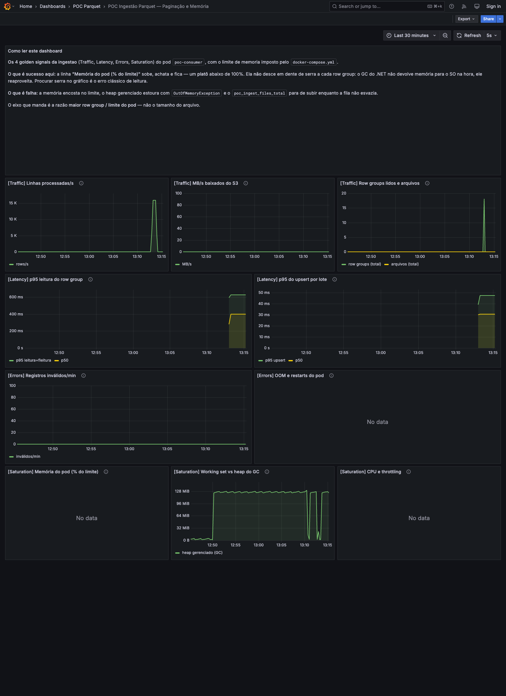

# Evidências do A/B — paginação por row group

Esta pasta guarda a **evidência bruta e versionada** do teste A/B que sustenta a tese central da
POC: **o pico de memória do leitor é definido pelo maior row group, não pelo tamanho do arquivo.**

Ela existe porque a prova desta POC não é uma afirmação, é um número — e número sem o log/CSV que o
produziu não é auditável. Os arquivos aqui são cópias literais do run final determinístico
(`reports/rowgroup_ab_20260913_132022.*`, que é gitignored).

> Contexto de projeto: [`../../README.md`](../../README.md) ·
> [`../aws-producao-ecs-fargate.md`](../aws-producao-ecs-fargate.md) ·
> [`../replicar-testes-e-metricas.md`](../replicar-testes-e-metricas.md) ·
> [`../memory-test-results.json`](../memory-test-results.json).

---

## 1. Objetivo

Provar, com o **mesmo limite de memória** e **o mesmo volume de dados**, que:

- um arquivo com **muitos row groups** é ingerido com memória **chapada**; e
- um arquivo com **um único row group gigante** falha por memória, mesmo sendo a mesma base.

O Parquet **não tem índice de linha**: a menor unidade endereçável é o **row group**, e quem define o
tamanho dele é o **writer** do arquivo, não o leitor. `Parquet.Net` (via `ReadColumnAsync`) devolve a
coluna inteira de um row group — então o piso de memória do leitor é, no mínimo, esse row group.

## 2. Ambiente medido

| Item | Valor |
|---|---|
| Host | Docker Desktop em macOS (Darwin), execução local |
| Runtime do worker | .NET **10.0.12** (`PocWorker`) |
| Memória do pod | `mem_limit` = `memswap_limit` = **192 MB** (sem swap) |
| GC | `DOTNET_gcServer=0`, `DOTNET_GCHeapHardLimitPercent=0x4B` (75% do cgroup) |
| S3/SQS | **ministack** (emulador local, MIT) |
| Dataset | **1.160.000 linhas × 40 colunas**; o consumer projeta **5 colunas** |
| Arquivos | mesmo total de linhas, row group diferente (ver `ab-parquet-metadata.txt`) |
| Runner | [`../../scripts/test_rowgroup_ab.sh`](../../scripts/test_rowgroup_ab.sh) (com asserção) |

Metadata dos parquets (medida do próprio arquivo, sem estimativa):

| Cenário | Arquivo em disco | Row groups | Maior RG (descomprimido) | Estimativa .NET ×3 |
|---|---|---|---|---|
| **MUITOS_RG** | 1.040,8 MiB | **58** (20.000 linhas cada) | **32,5 MiB** | 97,4 MiB |
| **UM_RG** | 964,1 MiB | **1** (1.160.000 linhas) | **1.803,6 MiB** | 5.410,9 MiB |

> A estimativa ×3 é o orçamento de pico usado na POC (`largest RG × 3`). O ×3 cobre o custo de
> materialização do row group no .NET (UTF-16, objetos, buffers). Detalhe por RG em
> [`ab-parquet-metadata.txt`](ab-parquet-metadata.txt).

## 3. Comandos exatos do run final

```bash
# 1. Infra: bucket + fila + DLQ + notificação (e política S3 -> SQS)
.venv/bin/python3 scripts/setup_infra.py

# 2. A/B com os parquets já gerados (--reuse), limite de 192 MB
PATH="$PWD/.venv/bin:$PATH" bash scripts/test_rowgroup_ab.sh --rows 1160000 --limit-mb 192 --reuse
```

O runner:
1. garante o bucket e **desliga temporariamente a notificação do bucket** durante o run (restaura no
   fim). O ministack **entrega** os eventos S3→SQS normalmente; o desligamento é por
   **determinismo**, para a notificação assíncrona do upload não virar mensagem extra — o disparo
   passa a ser explícito, via `simulate_s3_notification.py --mode sqs`;
2. em cada cenário: derruba o consumer → drena a fila **com o consumer DOWN** (purge main+DLQ com
   janela de confirmação) → trunca as tabelas → sobe o consumer com o `mem_limit` → drena de novo →
   dispara;
3. tem asserção: falha (`exit != 0`) se o comportamento não for o da tese.

## 4. Resultado

| Cenário | Row groups | Maior RG | Pico de memória | Resultado | `OOMKilled` | Linhas (ins / upd / err) | Tráfego S3 |
|---|---|---|---|---|---|---|---|
| **MUITOS_RG** | 58 | 32,5 MiB | **109,4 MiB** | **`ok`** | `false` | **+1.073.909 ins / ~85.920 upd / −0 err** | **29,6 MB / 120 req / 2,8%** |
| **UM_RG** | 1 | 1.803,6 MiB | **176,9 MiB** | **`out_of_memory`** (gerenciada) | `false` | 0 (falhou) | — |

Leituras:

- O MUITOS_RG concluiu 58/58 row groups com o working set **chapado** (CSV: 85,0 → 109,4 → 100,0
  MiB — sobe e estabiliza, sem dente de serra).
- O UM_RG **não** tem como ser paginado pelo leitor: o piso é o row group de 1.803,6 MiB. Ele falha
  por memória com ~176,9 MiB de pico.
- O S3Range transferiu **2,8%** do objeto (29,6 MB de 1.040,8 MiB) porque só as 5 colunas projetadas
  dos chunks do row group corrente foram lidas.

### Veredito (PASS) — citação literal do log

```
PASS: mesmo limite e mesmo tamanho de arquivo — varios row groups concluem,
      um row group unico estoura. A paginacao por row group esta demonstrada.
```

## 5. Modos de falha por memória (importante para operação)

A falha por memória tem **dois modos**, e a detecção precisa cobrir os dois:

1. **`OOMKilled` do kernel/cgroup** — exit 137, `OOMKilled=true`, **sem exceção no log** (o container
   simplesmente morre). Aparece no `docker inspect` e, no ECS, no stop reason/estado do container.
2. **`System.OutOfMemoryException` gerenciada** — o runtime .NET lança **antes** de o cgroup matar;
   nesse caso `OOMKilled=false` e o processo pode terminar com exit 0. É o modo observado no UM_RG
   deste run (stack em `ParquetProcessor.cs:262`, `Parquet.Schema.DataField.UnpackDefinitions`).

Qual modo ocorre depende do **`DOTNET_GCHeapHardLimitPercent`**: com `0x4B` (75% do cgroup) o heap
gerenciado estoura primeiro e vira exceção; sem a trava (ou com percentual maior) o kernel tende a
matar antes. Como um OOM gerenciado **não** aparece como `OOMKilled`, alerte sobre **os dois**
sinais: `OOMKilled`/stop reason da task **e** `OutOfMemoryException` no log + profundidade da DLQ.

> Análise consolidada: [`../memory-test-results.json`](../memory-test-results.json)
> (`resultados[].modo_de_falha`, `conclusao.modo_de_falha`) e
> [`../aws-producao-ecs-fargate.md`](../aws-producao-ecs-fargate.md) (§8 e §14).

## 6. Como reproduzir

```bash
# 0. Stack no ar e dependências no .venv
docker compose up -d
.venv/bin/python3 scripts/setup_infra.py

# 1. (Sem --reuse) gere os dois parquets do A/B (~2 GB, ~minutos)
.venv/bin/python3 scripts/generate_large_parquet.py --rows 1160000 \
    --row-group-rows 20000 --columns 40 --output data/ab_1160000_20000rg.parquet --upload
.venv/bin/python3 scripts/generate_large_parquet.py --rows 1160000 \
    --row-group-rows 1160000 --columns 40 --output data/ab_1160000_1rg.parquet --upload

# 2. Rode o A/B (com asserção). Use --reuse para não regenerar.
PATH="$PWD/.venv/bin:$PATH" bash scripts/test_rowgroup_ab.sh --rows 1160000 --limit-mb 192 --reuse
```

Smoke test rápido (mecânica em ~5 s, sem gerar 1 GB):

```bash
PATH="$PWD/.venv/bin:$PATH" bash scripts/test_rowgroup_ab.sh --rows 40000 --limit-mb 64
```

Critérios de sucesso e o passo a passo completo: [`../replicar-testes-e-metricas.md`](../replicar-testes-e-metricas.md).

## 7. Dashboard

O golden signal de saturação do pod (working set ÷ limite) e a curva do run:



> No Docker Desktop (cgroups aninhados) alguns painéis de **cadvisor** aparecem como "No data" —
> limitação conhecida do ambiente, documentada em
> [`../replicar-testes-e-metricas.md`](../replicar-testes-e-metricas.md) §4. A curva de memória
> auditável deste run está nos CSVs desta pasta.

## 8. Arquivos de evidência

| Arquivo | O que é |
|---|---|
| [`ab-limit192-final.log`](ab-limit192-final.log) | Log do runner: ordem dos cenários + **veredito PASS** (`pico 109,4` / `176,9` MiB) |
| [`ab-muitos-rg-memoria.csv`](ab-muitos-rg-memoria.csv) | Amostras `t_s,mem_mib,linhas` do MUITOS_RG (7 amostras, pico **109,4 MiB**) |
| [`ab-um-rg-memoria.csv`](ab-um-rg-memoria.csv) | Amostra do UM_RG (pico **176,9 MiB**, 0 linhas) |
| [`ab-muitos-rg-worker.log`](ab-muitos-rg-worker.log) | 58/58 RGs, `Result: +1073909 ins ~85920 upd -0 err`, S3Range **29,6 MB / 120 req / 2,8%** |
| [`ab-um-rg-worker.log`](ab-um-rg-worker.log) | `System.OutOfMemoryException` em `ParquetProcessor.cs:262`, `OOMKilled=false` |
| [`ab-parquet-metadata.txt`](ab-parquet-metadata.txt) | Metadata real dos parquets: rows, cols, RGs, maior RG, estimativa ×3 |
